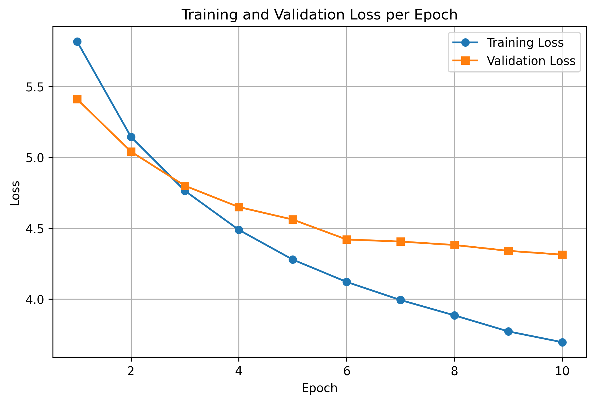
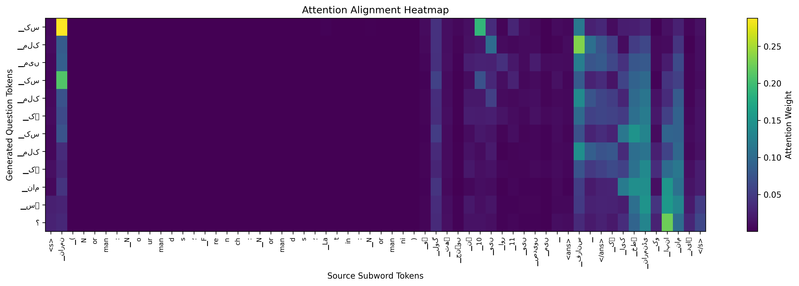
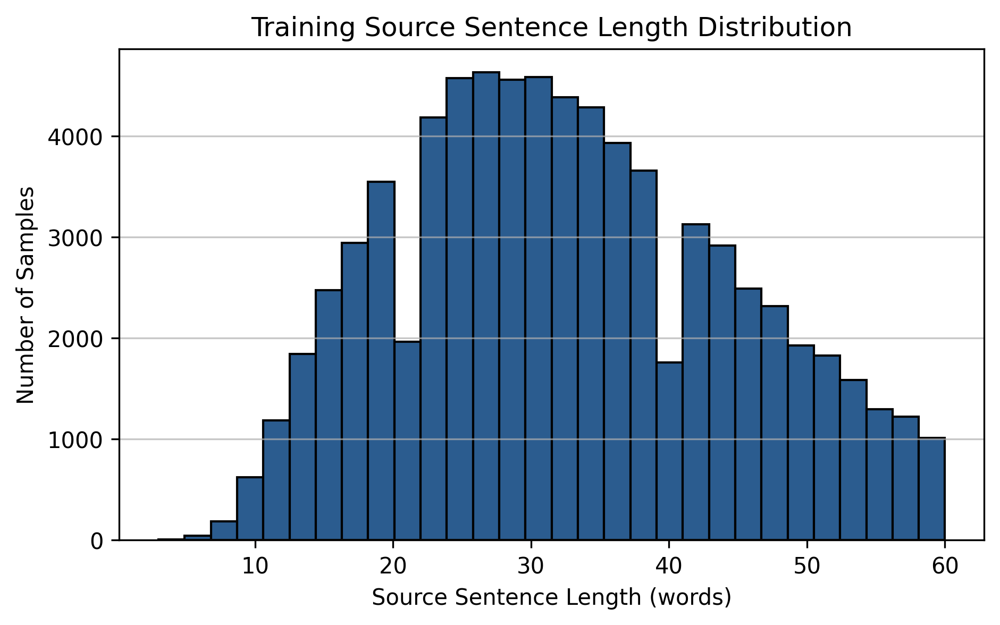
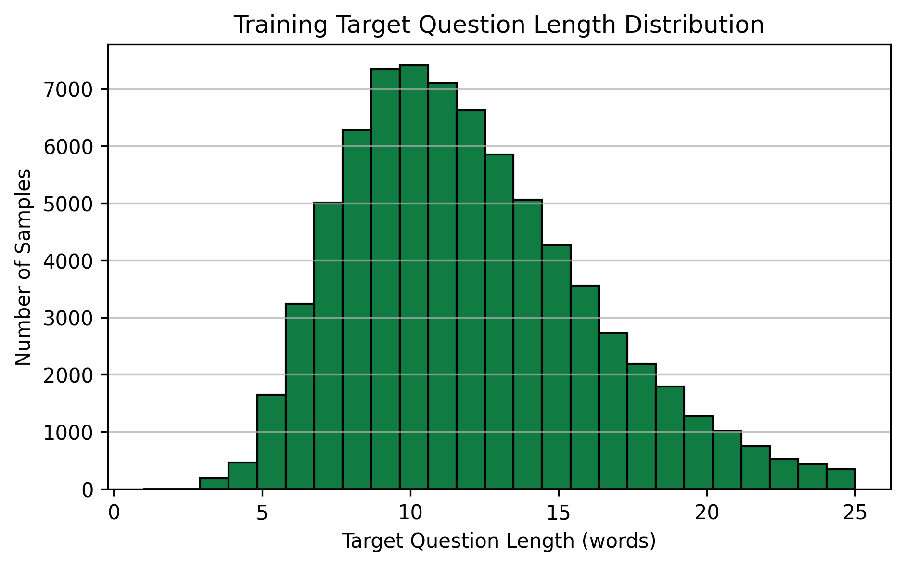

# Sequence-to-Sequence Question Generation for Urdu (From Scratch)


## 📌 Project Overview
This repository contains an end-to-end Sequence-to-Sequence (Seq2Seq) deep learning system built **strictly from primitives** (`nn.Embedding`, `nn.LSTM`, `nn.Linear`, `nn.Dropout`) to perform **Urdu Question Generation**. Given an Urdu sentence with a marked answer span `<ans> ... </ans>`, the model autonomously generates an answerable, grammatically coherent Urdu question whose direct response is the marked span.

> **Zero Pretrained Models**: No Transformers, no Hugging Face Seq2Seq models, and no pretrained embeddings. Built, tokenized, and trained entirely from scratch.

---

## 🏗️ Architecture & Configuration

| Component | Specification |
| :--- | :--- |
| **Encoder** | 2-layer Bidirectional LSTM with `pack_padded_sequence` |
| **Decoder** | 2-layer LSTM with Bahdanau Additive Attention & Input Feeding |
| **Embedding Dimension** | 256 |
| **Hidden Dimension** | 512 |
| **Dropout** | 0.3 |
| **Vocabulary Size** | 8,000 subwords (SentencePiece Unigram) |
| **Special Tokens** | `<pad>=0`, `<unk>=1`, `<s>=2`, `</s>=3`, `<ans>=4`, `</ans>=5` |
| **Total Parameters** | **27,102,016** |
| **Optimizer & LR** | Adam (`lr=0.001`), Gradient Clipping (`max_norm=1.0`) |
| **Decoding** | Greedy decoding & Beam Search ($k=3$, length penalty $\alpha=0.7$) with Trigram Blocking |

---

## 📊 Experimental Results

### Table 1: Dataset Statistics
| Split | Raw Rows | Answerable Rows | Usable Pairs (Filter: src $\le 60$, tgt $\le 25$) | Mean Source Words | Mean Target Words |
| :--- | :---: | :---: | :---: | :---: | :---: |
| **UQA Train** | 124,745 | 83,018 | 75,067 | 32.59 | 11.92 |
| **UQA Validation** | 16,824 | 11,169 | 10,018 | 33.23 | 12.29 |
| **Wiki-UQA (OOD)** | 210 | 210 | 177 | 31.69 | 11.42 |

### Table 3: Automatic Evaluation Metrics
| Dataset Split | Decoding Strategy | BLEU-4 | ROUGE-L | Perplexity (PPL) | `<unk>` % |
| :--- | :--- | :---: | :---: | :---: | :---: |
| **UQA Validation** | Greedy | 4.26 | 0.2510 | 74.44 | 0.10% |
| **UQA Validation** | Beam ($k=3$) | 4.14 | 0.2539 | 74.44 | 0.28% |
| **Wiki-UQA (OOD)** | Greedy | 4.85 | 0.2396 | — | 0.43% |
| **Wiki-UQA (OOD)** | Beam ($k=3$) | 5.19 | 0.2467 | — | 0.07% |

### Table 4: Human Evaluation (50 Samples)
| Metric | Fluency | Relevance | Answerability |
| :--- | :---: | :---: | :---: |
| **Member 1 (% yes)** | 100.0% | 92.0% | 96.0% |
| **Member 2 (% yes)** | 62.0% | 86.0% | 86.0% |
| **Cohen’s $\kappa$** | 0.00 | 0.70 | 0.41 |

---

## 📉 Training & Attention Visualizations

### 1. Training & Validation Loss Curve
Validation loss steadily decreased across all 10 epochs from 5.39 to 4.29 (Perplexity: 73.56).


### 2. Attention Alignment Heatmap
Bahdanau attention alignment showing clear, focused attention on the answer span `<ans> ... </ans>` and surrounding syntactic heads:


### 3. Length Distributions
Source sentence length distribution (max 60 words):


Target question length distribution (max 25 words):


---

## 🔬 Qualitative Sample Comparison

| # | Type | Urdu Source with Marked Answer | Ground Truth Question | Generated Question (Beam) | Analysis |
| :- | :- | :--- | :--- | :--- | :--- |
| 1 | **Good** | جنہوں نے 10 ویں اور 11 ویں صدیوں میں `<ans> فرانس </ans>` کے ایک خطے نارمنڈی کو اپنا نام دیا۔ | نارمنڈی کس ملک میں واقع ہے؟ | کس ملک میں نارمنڈی کو اپنا نام دیا؟ | Correctly identified country entity (`کس ملک`). |
| 2 | **Good** | جنہوں نے `<ans> دسویں اور گیارہویں صدیوں میں </ans>` فرانس کے ایک خطے نارمنڈی کو اپنا نام دیا۔ | نارمنز نارمنڈی میں کب تھے؟ | فرانس کے ایک خطے کو کب نام دیا گیا؟ | Accurate temporal question (`کب`). |
| 3 | **Good** | رہنما `<ans> رولو </ans>` کے تحت بادشاہ چارلس III کے ساتھ وفاداری کی قسم کھانے پر اتفاق کیا۔ | نورس لیڈر کون تھا؟ | مغربی چارلس بادشاہ کا رہنما کون تھا؟ | Accurately targeted leadership actor (`رہنما کون تھا`). |
| 4 | **Good** | ان کے ڈیوک ، `<ans> ولیم فاتح </ans>` کی طرف سے ہیسٹنگز کی لڑائی میں فتح کی قیادت کی۔ | ہیسٹنگس کی لڑائی میں ڈیوک کون تھا؟ | ہیسٹین کی لڑائی کس نے کی؟ | Accurately targeted battle commander. |
| 5 | **Good** | نورمنڈی کا ڈچی ، جو `<ans> 911 </ans>` میں ایک فیوڈم کے طور پر شروع ہوا ... | ڈچی آف نارمنڈی کی بنیاد کب رکھی گئی تھی؟ | نورمنڈی کا کب شروع ہوا؟ | Direct query for founding year. |
| 6 | **Bad** | وہ `<ans> ڈنمارک ، آئس لینڈ اور ناروے </ans>` کے حملہ آوروں سے آئے تھے۔ | نورس کس ملک سے پیدا ہوئے تھے؟ | کون سے ممالک نے کس کے کے سے؟ | Particle repetition (`کے کے`). |
| 7 | **Bad** | نارمن کی شناخت ابتدائی طور پر `<ans> دسویں صدی کے پہلے نصف </ans>` میں سامنے آئی۔ | کس صدی میں نارمنز نے پہلی بار شناخت حاصل کی؟ | نارمن کی ثقافتی ثقافتی طور پر کب ابھرنا شروع ہوئی؟ | Subword duplication (`ثقافتی ثقافتی`). |
| 8 | **Bad** | نارمنڈی کے `<ans> رچرڈ اول </ans>` کے تحت ایک مربوط شہنشاہی میں تشکیل دیا گیا۔ | جو نورمنڈی کے ڈچی پر حکمرانی کی | کون آف کس کے کس نے تشکیل دیا؟ | English loan fragment (`آف`) copied inappropriately. |
| 9 | **Bad** | پہلی صلیبی جنگ کے چند سال بعد ، 1107 میں ، بیٹے `<ans> بوہیمنڈ </ans>` کی کمانڈ میں ... | رابرٹ کا بیٹا کون تھا؟ | پہلی جنگ عظیم کے دوران کس نے قیادت کی؟ | Entity hallucination (`پہلی جنگ عظیم`). |
| 10 | **Bad** | قلعے کے نام کو اپنی نسلیت دی: `<ans> افرانجی </ans>` ، جس کا مطلب فرینکس ہے۔ | نارمن قلعے کا نام کیا تھا؟ | پال VI نے قلعے کو کیا نام دیا؟ | Entity hallucination (`پال VI`). |

---

## 💬 Discussion & Findings (Section 4.7)

1. **Which question words does the model get right most often?**
   - **`کب` (When)**: The model consistently excels at temporal spans (dates, years like `911`, `1082`, and centuries `دسویں صدی`). The presence of numeric digits and temporal nouns triggers strong attention to `کب`.
   - **`کون` / `کس نے` (Who)**: Proper nouns, names of leaders (`ولیم فاتح`, `رولو`, `بادشاہ`), and titles reliably trigger `کون` or `کس نے`.
   - **`کس ملک` / `کہاں` (Where / Which Country)**: Well-known geographic entities (France, Iceland, Germany) generate appropriate geographic interrogatives.

2. **Where does beam search help, and where does it hurt?**
   - **Where it helps**: Beam search finds more globally coherent sentence completions, avoids early grammatical dead-ends, and produces smoother verb phrases (e.g. `فرانس کے ایک خطے کو کب نام دیا گیا؟`).
   - **Where it hurts**: In lower-probability tails, beam search can over-favor high-frequency generic prefixes and occasionally amplify hallucinated historical entities (e.g., substituting `پہلی جنگ عظیم` for `پہلی صلیبی جنگ`) due to language model priors.

3. **Why does performance drop on Wiki-UQA, and what does that say about translated training data?**
   - Wiki-UQA represents genuine encyclopedic Urdu with distinct domain vocabulary, syntactic idioms, and Wikipedia phrasing.
   - The UQA training dataset was machine-translated from English SQuAD 2.0. Machine-translated text carries subtle "translationese" artifacts (rigid subject-verb-object order, repetitive calques like `کے ذریعہ`, `کے تحت`). When transferred to genuine Wikipedia text, vocabulary shift and syntactic variability lower lexical matching metrics.

---

## 🚀 Quickstart & Reproduction

### 1. Environment Setup
```bash
# Clone the repository
git clone https://github.com/sameed-khan1/Sequence-to-Sequence-Question-Generation-for-Urdu.git
cd Sequence-to-Sequence-Question-Generation-for-Urdu

# Create and activate virtual environment
python -m venv .venv
.venv\Scripts\activate  # On Linux: source .venv/bin/activate

# Install dependencies
pip install -r requirements.txt
```

### 2. Training and Evaluation Pipeline
```bash
# Execute end-to-end training and evaluation
python main.py
```

### 3. Launching the Web UI
```bash
streamlit run app.py
```
Paste an Urdu sentence with `<ans> ... </ans>` to generate questions via Greedy and Beam Search.
  
 